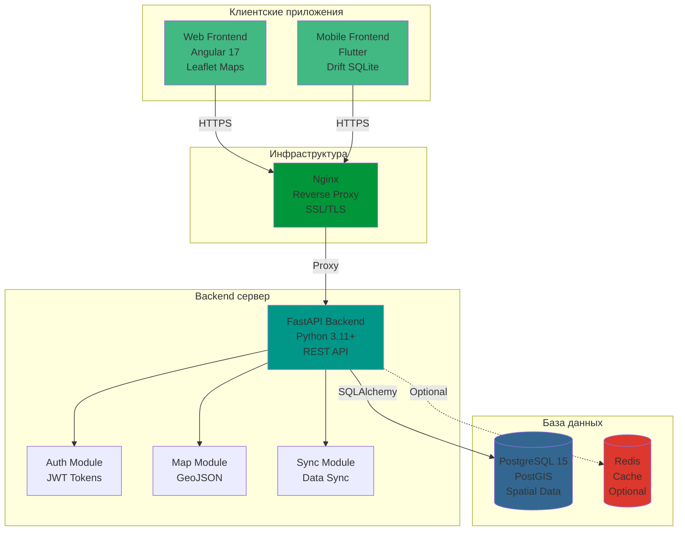
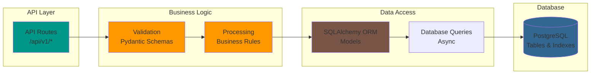
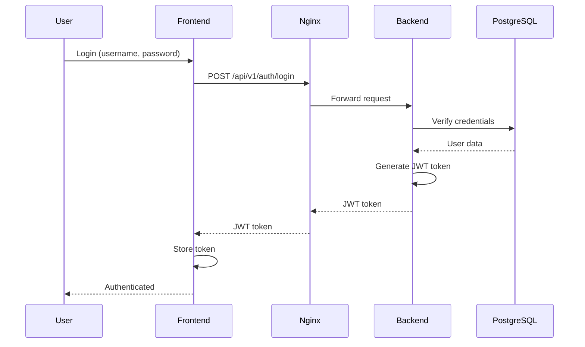
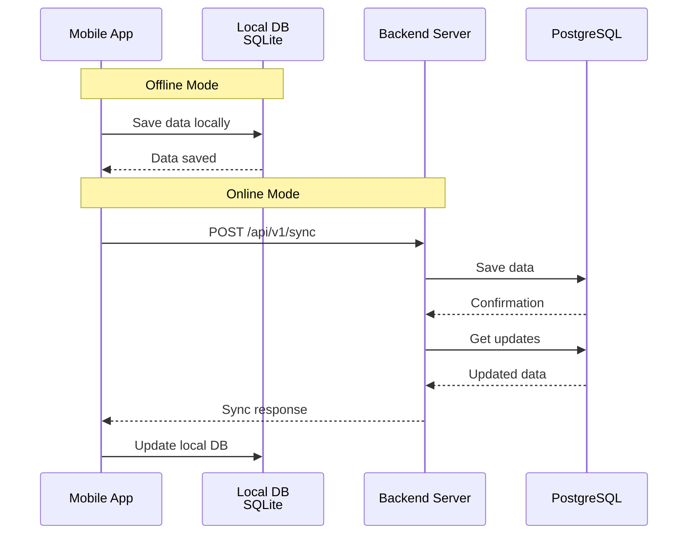
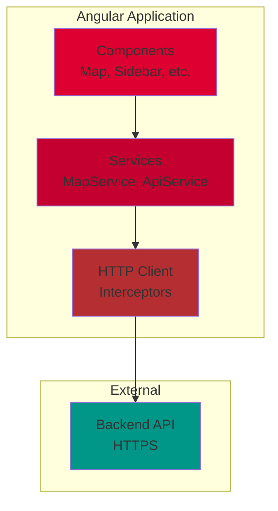
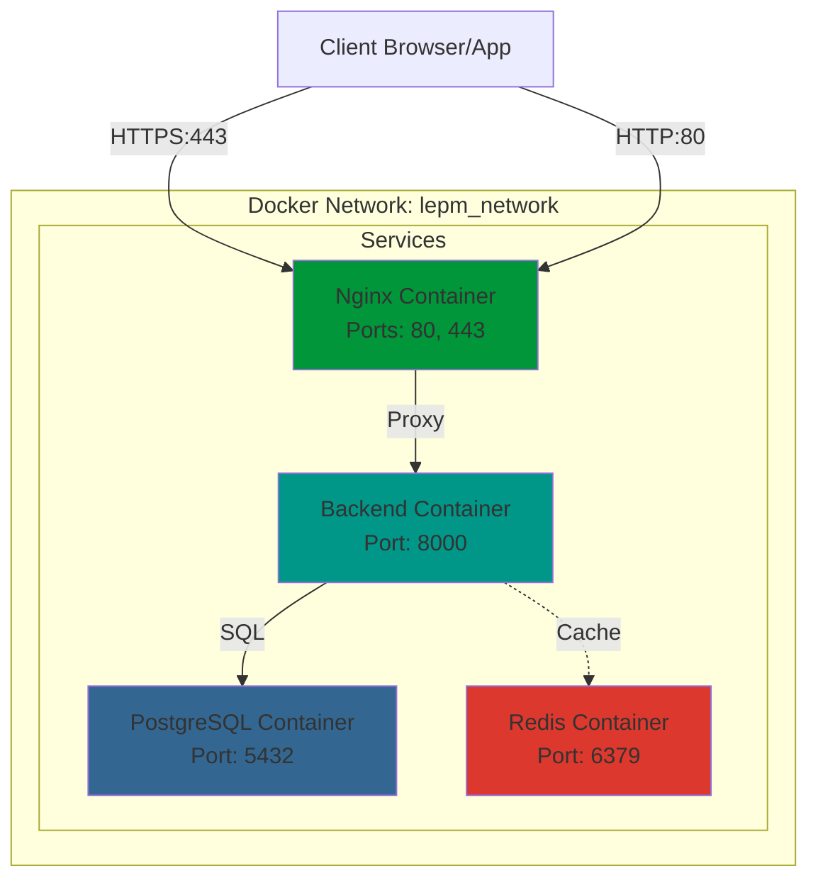
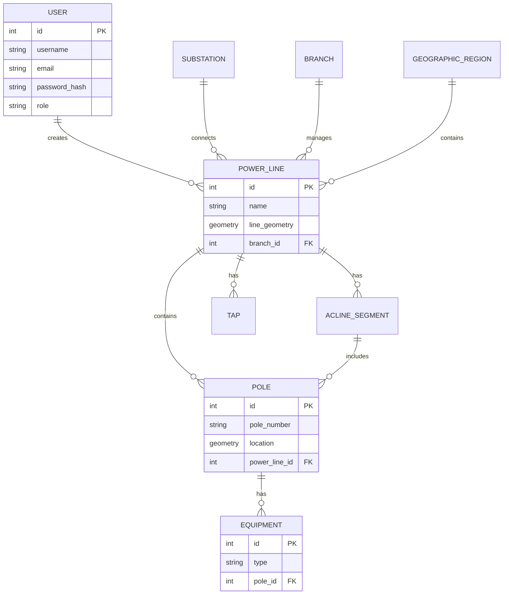
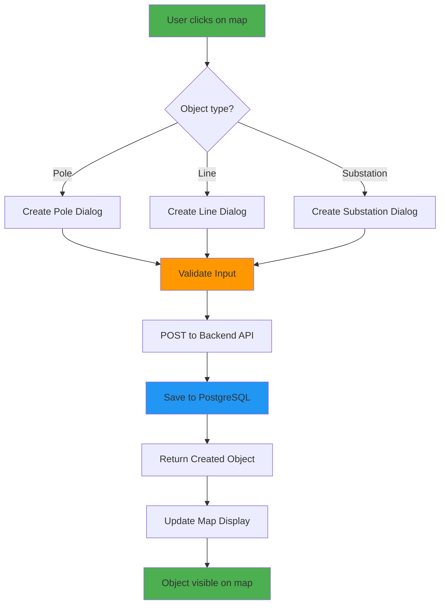

# Диаграмма архитектуры системы (Mermaid)

## Общая архитектура системы

## Детальная архитектура Backend

## Поток аутентификации

## Поток синхронизации данных (Mobile)

## Архитектура компонентов Frontend (Angular)

## Docker Compose архитектура

## Модель данных (ER диаграмма)

## Поток создания объекта на карте

